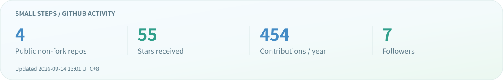

  <a href="./README.md">简体中文</a> &nbsp;/&nbsp; <strong>English</strong>

<picture>
  <source media="(max-width: 600px) and (prefers-reduced-motion: reduce)" srcset="./assets/profile/hero-mobile-en-static.svg" />
  <source media="(prefers-reduced-motion: reduce)" srcset="./assets/profile/hero-en-static.svg" />
  <source media="(max-width: 600px)" srcset="./assets/profile/hero-mobile-en.svg" />
  
</picture>

  <a href="#about">About</a> &nbsp; · &nbsp; <a href="#work">Selected work</a> &nbsp; · &nbsp; <a href="#craft">How I build</a> &nbsp; · &nbsp; <a href="#stack">Toolbox</a> &nbsp; · &nbsp; <a href="#activity">Open-source activity</a>

## About

I'm a developer focused on **RAG and agent systems engineering**: how knowledge becomes context, and how context turns into reliable action.

This is where I share open-source work, engineering experiments and things I learn along the way. My current focus is **MCP tool environments and reproducible evaluation**, alongside retrieval, memory, runtimes and safety boundaries.

| Context | Runtime | Evaluation |
| :--- | :--- | :--- |
| Retrieval · Reranking · Knowledge graphs | MCP · State · Recovery | Tracing · Assertions · Reproducibility |
| Bring useful information into context | Give every action clear boundaries | Make improvement measurable |

### Currently exploring

- **Task-aware retrieval**: query planning, hybrid search and reranking, with evidence that actually helps answer the question at hand.
- **Reproducible tool environments**: MCP, state snapshots and isolated runs that make multi-step agent behavior easier to compare reliably.
- **Context as a managed resource**: memory selection, context budgets and tool information, balancing quality, cost and latency.

I want to turn these explorations into clear code, runnable experiments and evidence-backed documentation—and make this space a growing engineering notebook.

Engineering details I care about

- **Context quality**: relevance and evidence matter more than simply adding length.
- **Tool boundaries**: permissions, budgets and failure semantics belong in the architecture.
- **Visible state**: multi-step execution should be traceable, inspectable and recoverable.
- **Reproducible evaluation**: compare improvements by running again from the same starting point.

## Selected work

<a href="https://github.com/augety121/MCP-State-Twin">
<picture>
  <source media="(max-width: 600px) and (prefers-reduced-motion: reduce)" srcset="./assets/profile/project-mobile-en-static.svg" />
  <source media="(prefers-reduced-motion: reduce)" srcset="./assets/profile/project-en-static.svg" />
  <source media="(max-width: 600px)" srcset="./assets/profile/project-mobile-en.svg" />
  
</picture>
</a>

Building **reproducible, forkable, stateful MCP test worlds** for AI agent evaluation. Runs start from the same snapshot, use tools in isolated environments, and compare their final states.

[Explore the code →](https://github.com/augety121/MCP-State-Twin) &nbsp; [Read the docs](https://github.com/augety121/MCP-State-Twin/tree/main/docs) &nbsp; [Discuss an issue](https://github.com/augety121/MCP-State-Twin/issues)

Development preview. See the project documentation for implemented capabilities and limitations.

## How I build

I prefer to start with a concrete problem and a small, verifiable loop, then gradually add state management, boundaries and observability.

<picture>
  <source media="(max-width: 600px) and (prefers-reduced-motion: reduce)" srcset="./assets/profile/craft-mobile-en-static.svg" />
  <source media="(prefers-reduced-motion: reduce)" srcset="./assets/profile/craft-en-static.svg" />
  <source media="(max-width: 600px)" srcset="./assets/profile/craft-mobile-en.svg" />
  
</picture>

- **Small, complete implementations**: give each change a clear goal, inputs, outputs and scope.
- **Reviewable results**: document successful paths, failure cases and important trade-offs together.
- **Evolving designs**: understand real constraints before choosing abstractions, interfaces and extension points.

## Toolbox

  

**Languages** &nbsp; Python · TypeScript · Go · Kotlin 
**Engineering tools** &nbsp; Docker · PostgreSQL · Redis · Git · GitHub Actions

Beyond the technology stack

Interfaces and data contracts, testing and continuous integration, logs and execution traces, resource budgets, permission boundaries, and documentation that helps the next reader understand the system.

Tools change. What I want to keep improving is the ability to analyze problems, test assumptions and build dependable systems.

## Open-source activity

<picture>
  <source media="(max-width: 600px)" srcset="./assets/profile/stats-mobile-en.svg" />
  
</picture>

Contribution trail · Small steps add up

  <picture>
    <source media="(prefers-reduced-motion: reduce)" srcset="./assets/profile/contributions-static.svg" />
    
  </picture>

Stats and contribution animation update daily through GitHub Actions; the card shows the update date. This is not a live online indicator. Animation powered by <a href="https://github.com/Platane/snk">Platane/snk</a>.

---

### Let's connect

Interested in **RAG, context engineering, MCP or agent evaluation**? Let's start with a question, a piece of code, or an experiment.

That could be a retrieval improvement, a tool-interface trade-off, an evaluation method, or an idea worth reproducing together. Specific questions and different perspectives are always valuable.

[My repositories](https://github.com/augety121?tab=repositories) &nbsp; · &nbsp; [Project discussions](https://github.com/augety121/MCP-State-Twin/issues) &nbsp; · &nbsp; [Profile feedback](https://github.com/augety121/augety121/issues)

<picture>
  <source media="(prefers-reduced-motion: reduce)" srcset="./assets/profile/footer-en-static.svg" />
  
</picture>
