  <a href="./README.md">简体中文</a> &nbsp;/&nbsp; <strong>English</strong>

<picture>
  <source media="(max-width: 600px) and (prefers-reduced-motion: reduce)" srcset="./assets/profile/hero-mobile-en-static.svg" />
  <source media="(prefers-reduced-motion: reduce)" srcset="./assets/profile/hero-en-static.svg" />
  <source media="(max-width: 600px)" srcset="./assets/profile/hero-mobile-en.svg" />
  
</picture>

  <a href="#about">About</a> &nbsp; · &nbsp; <a href="#work">Selected work</a> &nbsp; · &nbsp; <a href="#craft">How I build</a> &nbsp; · &nbsp; <a href="#stack">Toolbox</a> &nbsp; · &nbsp; <a href="#activity">Open-source activity</a>

## About

I'm a developer focused on **RAG and agent systems engineering**: how knowledge becomes context, and how context turns into reliable action.

This is where I share open-source work, from **MCP tool environments and reproducible evaluation** to local tools and browser extensions. Less repetitive work, with clearer boundaries for data and actions.

<picture>
  <source media="(max-width: 600px) and (prefers-reduced-motion: reduce)" srcset="./assets/profile/focus-mobile-en-static.svg" />
  <source media="(prefers-reduced-motion: reduce)" srcset="./assets/profile/focus-en-static.svg" />
  <source media="(max-width: 600px)" srcset="./assets/profile/focus-mobile-en.svg" />
  
</picture>

Current explorations & engineering details

### Currently exploring

- **Task-aware retrieval**: query planning, hybrid search and reranking, with evidence that actually helps answer the question at hand.
- **Reproducible tool environments**: MCP, state snapshots and isolated runs that make multi-step agent behavior easier to compare reliably.
- **Context as a managed resource**: memory selection, context budgets and tool information, balancing quality, cost and latency.

I want to turn these explorations into clear code, runnable experiments and evidence-backed documentation—and make this space a growing engineering notebook.

### Engineering details I care about

- **Context quality**: relevance and evidence matter more than simply adding length.
- **Tool boundaries**: permissions, budgets and failure semantics belong in the architecture.
- **Visible state**: multi-step execution should be traceable, inspectable and recoverable.
- **Reproducible evaluation**: compare improvements by running again from the same starting point.

## Selected work

Public work spanning agent workspaces, evaluation environments and practical everyday tools.

  <strong>Agents</strong> &nbsp; <a href="#project-hashmm">Workspace</a> &nbsp; · &nbsp; <a href="#project-twin">Evaluation</a> 
  <strong>Tools</strong> &nbsp; <a href="#project-resume">Form filling</a> &nbsp; · &nbsp; <a href="#project-applykit">Documents</a> &nbsp; · &nbsp; <a href="#project-autumn">Job posts</a>

### Agents & evaluation

<a href="https://github.com/augety121/HashMM-RAG-Agent">
<picture>
  <source media="(max-width: 600px) and (prefers-reduced-motion: reduce)" srcset="./assets/profile/project-hashmm-mobile-en-static.svg" />
  <source media="(prefers-reduced-motion: reduce)" srcset="./assets/profile/project-hashmm-en-static.svg" />
  <source media="(max-width: 600px)" srcset="./assets/profile/project-hashmm-mobile-en.svg" />
  
</picture>
</a>

A workspace bringing together **knowledge retrieval, cited evidence and recoverable tasks**, with desktop, Android and tool extensions. This links to the published historical edition; see the repository for its capabilities and limitations.

[Explore the code →](https://github.com/augety121/HashMM-RAG-Agent) &nbsp; [Overview](https://github.com/augety121/HashMM-RAG-Agent#readme) &nbsp; [Contribute](https://github.com/augety121/HashMM-RAG-Agent/blob/main/COMMUNITY.md)

<a href="https://github.com/augety121/MCP-State-Twin">
<picture>
  <source media="(max-width: 600px) and (prefers-reduced-motion: reduce)" srcset="./assets/profile/project-mobile-en-static.svg" />
  <source media="(prefers-reduced-motion: reduce)" srcset="./assets/profile/project-en-static.svg" />
  <source media="(max-width: 600px)" srcset="./assets/profile/project-mobile-en.svg" />
  
</picture>
</a>

Building **reproducible, forkable, stateful MCP test worlds** for AI agent evaluation. Runs start from the same snapshot, use tools in isolated environments, and compare their final states.

[Explore the code →](https://github.com/augety121/MCP-State-Twin) &nbsp; [Read the docs](https://github.com/augety121/MCP-State-Twin/tree/main/docs) &nbsp; [Discuss an issue](https://github.com/augety121/MCP-State-Twin/issues)

Development preview; see the docs for implemented capabilities.

### Practical tools

<a href="https://github.com/augety121/jianlitianxie">
<picture>
  <source media="(max-width: 600px) and (prefers-reduced-motion: reduce)" srcset="./assets/profile/project-resume-mobile-en-static.svg" />
  <source media="(prefers-reduced-motion: reduce)" srcset="./assets/profile/project-resume-en-static.svg" />
  <source media="(max-width: 600px)" srcset="./assets/profile/project-resume-mobile-en.svg" />
  
</picture>
</a>

A **local form-filling assistant** for Chrome / Edge: verify facts, review mappings and fill selected fields. Local mode makes no model calls; temporary MCP collaboration is optional. It never submits applications automatically.

[Explore the code →](https://github.com/augety121/jianlitianxie) &nbsp; [Installation & usage](https://github.com/augety121/jianlitianxie/blob/main/docs/INSTALL-0.4.3.md) &nbsp; [Privacy & permissions](https://github.com/augety121/jianlitianxie/blob/main/docs/PRIVACY-0.4.3.md)

See the project for supported sites and controls; always review the filled form.

<a href="https://github.com/augety121/ApplyKit">
<picture>
  <source media="(max-width: 600px) and (prefers-reduced-motion: reduce)" srcset="./assets/profile/project-applykit-mobile-en-static.svg" />
  <source media="(prefers-reduced-motion: reduce)" srcset="./assets/profile/project-applykit-en-static.svg" />
  <source media="(max-width: 600px)" srcset="./assets/profile/project-applykit-mobile-en.svg" />
  
</picture>
</a>

A **local Windows utility** for preparing application documents: crop images, convert PDFs and compress files to meet upload limits. Keeps originals and does not upload documents to the internet.

[Explore the code →](https://github.com/augety121/ApplyKit) &nbsp; [Download](https://github.com/augety121/ApplyKit/releases) &nbsp; [User guide](https://github.com/augety121/ApplyKit#readme)

<a href="https://github.com/augety121/autumn-jobs-crawler">
<picture>
  <source media="(max-width: 600px) and (prefers-reduced-motion: reduce)" srcset="./assets/profile/project-autumn-mobile-en-static.svg" />
  <source media="(prefers-reduced-motion: reduce)" srcset="./assets/profile/project-autumn-en-static.svg" />
  <source media="(max-width: 600px)" srcset="./assets/profile/project-autumn-mobile-en.svg" />
  
</picture>
</a>

Turns **public campus hiring announcements from official company websites** into filterable Excel records. Includes source checks, rate limits, deduplication and a manual review queue; no automatic login, verification bypass or job applications.

[Explore the code →](https://github.com/augety121/autumn-jobs-crawler) &nbsp; [User guide](https://github.com/augety121/autumn-jobs-crawler#readme) &nbsp; [Safety boundaries](https://github.com/augety121/autumn-jobs-crawler/blob/main/SECURITY.md)

[Browse all public repositories →](https://github.com/augety121?tab=repositories&type=public)

Reading guide & project boundaries

- **Start with the overview**: each README explains the use case and setup; documentation covers design and limitations.
- **HashMM** is a historical open-source edition; **MCP State Twin** remains a development preview. Roadmaps are not implemented features.
- **Resume Fill Assistant** uses explicitly selected facts and never submits applications automatically; **ApplyKit** preserves originals; **Autumn Jobs Crawler** routes restricted or uncertain sources to manual review.
- Explore MCP State Twin through its [overview](https://github.com/augety121/MCP-State-Twin#readme), [design docs](https://github.com/augety121/MCP-State-Twin/tree/main/docs) and [Issues](https://github.com/augety121/MCP-State-Twin/issues).

## How I build

I prefer to start with a concrete problem and a small, verifiable loop, then gradually add state management, boundaries and observability.

<picture>
  <source media="(max-width: 600px) and (prefers-reduced-motion: reduce)" srcset="./assets/profile/craft-mobile-en-static.svg" />
  <source media="(prefers-reduced-motion: reduce)" srcset="./assets/profile/craft-en-static.svg" />
  <source media="(max-width: 600px)" srcset="./assets/profile/craft-mobile-en.svg" />
  
</picture>

Explore my engineering principles

- **Small, complete implementations**: give each change a clear goal, inputs, outputs and scope.
- **Reviewable results**: document successful paths, failure cases and important trade-offs together.
- **Evolving designs**: understand real constraints before choosing abstractions, interfaces and extension points.

## Toolbox

  

**Languages** &nbsp; Python · TypeScript · Go · Kotlin 
**Engineering tools** &nbsp; Docker · PostgreSQL · Redis · Git · GitHub Actions

Beyond the technology stack

Interfaces and data contracts, testing and continuous integration, logs and execution traces, resource budgets, permission boundaries, and documentation that helps the next reader understand the system.

Tools change. What I want to keep improving is the ability to analyze problems, test assumptions and build dependable systems.

## Open-source activity

<picture>
  <source media="(max-width: 600px)" srcset="./assets/profile/stats-mobile-en.svg" />
  
</picture>

  <picture>
    <source media="(prefers-reduced-motion: reduce)" srcset="./assets/profile/contributions-static.svg" />
    <source media="(max-width: 600px)" srcset="./assets/profile/contribution-mobile-en.svg" />
    
  </picture>

Stats and contribution animation update daily through GitHub Actions; the card shows the update date. This is not a live online indicator. Animation powered by <a href="https://github.com/Platane/snk">Platane/snk</a>.

---

### Let's connect

Interested in **RAG, context engineering, MCP or agent evaluation**? Let's start with a specific question, a piece of code or a reproducible experiment.

[My repositories](https://github.com/augety121?tab=repositories) &nbsp; · &nbsp; [Project discussions](https://github.com/augety121/MCP-State-Twin/issues) &nbsp; · &nbsp; [Profile feedback](https://github.com/augety121/augety121/issues)

<picture>
  <source media="(prefers-reduced-motion: reduce)" srcset="./assets/profile/footer-en-static.svg" />
  
</picture>

<a href="#top">Back to top ↑</a>

