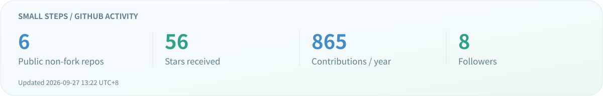

  <a href="./README.md">简体中文</a> &nbsp;/&nbsp; <strong>English</strong>

<picture>
  <source media="(max-width: 600px) and (prefers-reduced-motion: reduce)" srcset="./assets/profile/hero-mobile-en-static.svg" />
  <source media="(prefers-reduced-motion: reduce)" srcset="./assets/profile/hero-en-static.svg" />
  <source media="(max-width: 600px)" srcset="./assets/profile/hero-mobile-en.svg" />
  
</picture>

  <a href="#about">About</a> &nbsp; · &nbsp; <a href="#work">Selected work</a> &nbsp; · &nbsp; <a href="#craft">How I build</a> &nbsp; · &nbsp; <a href="#stack">Toolbox</a> &nbsp; · &nbsp; <a href="#activity">Open-source activity</a>

## About

I'm a developer focused on **RAG and agent systems engineering**: how knowledge becomes context, and how context turns into reliable action.

This is where I share open-source work, from **MCP tool environments and reproducible evaluation** to local tools and browser extensions. Less repetitive work, with clearer boundaries for data and actions.

<picture>
  <source media="(max-width: 600px) and (prefers-reduced-motion: reduce)" srcset="./assets/profile/focus-mobile-en-static.svg" />
  <source media="(prefers-reduced-motion: reduce)" srcset="./assets/profile/focus-en-static.svg" />
  <source media="(max-width: 600px)" srcset="./assets/profile/focus-mobile-en.svg" />
  
</picture>

### Currently exploring

- **Retrieval & memory** — relevant evidence and context that stays useful.
- **Tools & state** — multi-step execution that can be traced, isolated and recovered.
- **Evaluation & feedback** — the same starting point, with measurable improvements.

Engineering details I care about

- **Context quality**: relevance and evidence matter more than simply adding length.
- **Tool boundaries**: permissions, budgets and failure semantics belong in the architecture.
- **Visible state**: multi-step execution should be traceable, inspectable and recoverable.
- **Reproducible evaluation**: compare improvements by running again from the same starting point.

## Selected work

Some projects explore what agents can do and where their boundaries lie. Others take repetitive work out of everyday life.

  <a href="#project-hashmm">Workspace</a> &nbsp; · &nbsp; <a href="#project-twin">Evaluation</a> 
  <a href="#project-resume">Form filling</a> &nbsp; · &nbsp; <a href="#project-applykit">Documents</a> &nbsp; · &nbsp; <a href="#project-autumn">Job posts</a>

### Agents & evaluation

From retrieval to action, and from execution back to verifiable evidence.

<a href="https://github.com/augety121/HashMM-RAG-Agent">
<picture>
  <source media="(max-width: 600px) and (prefers-reduced-motion: reduce)" srcset="./assets/profile/project-hashmm-mobile-en-static.svg" />
  <source media="(prefers-reduced-motion: reduce)" srcset="./assets/profile/project-hashmm-en-static.svg" />
  <source media="(max-width: 600px)" srcset="./assets/profile/project-hashmm-mobile-en.svg" />
  
</picture>
</a>

A local workspace connecting **knowledge retrieval, cited evidence and recoverable tasks**. This links to the published historical edition.

[Source →](https://github.com/augety121/HashMM-RAG-Agent) &nbsp; [Overview](https://github.com/augety121/HashMM-RAG-Agent#readme) &nbsp; [Contribute](https://github.com/augety121/HashMM-RAG-Agent/blob/main/COMMUNITY.md)

 

<a href="https://github.com/augety121/MCP-State-Twin">
<picture>
  <source media="(max-width: 600px) and (prefers-reduced-motion: reduce)" srcset="./assets/profile/project-mobile-en-static.svg" />
  <source media="(prefers-reduced-motion: reduce)" srcset="./assets/profile/project-en-static.svg" />
  <source media="(max-width: 600px)" srcset="./assets/profile/project-mobile-en.svg" />
  
</picture>
</a>

A **reproducible MCP test environment** for agents: fork runs from the same snapshot, use tools in isolation, and compare final states.

[Source →](https://github.com/augety121/MCP-State-Twin) &nbsp; [Docs](https://github.com/augety121/MCP-State-Twin/tree/main/docs) &nbsp; [Issues](https://github.com/augety121/MCP-State-Twin/issues)

### Practical tools

Organize information, prepare documents, and automate repetitive steps—while keeping the final decision with the person.

<a href="https://github.com/augety121/jianlitianxie">
<picture>
  <source media="(max-width: 600px) and (prefers-reduced-motion: reduce)" srcset="./assets/profile/project-resume-mobile-en-static.svg" />
  <source media="(prefers-reduced-motion: reduce)" srcset="./assets/profile/project-resume-en-static.svg" />
  <source media="(max-width: 600px)" srcset="./assets/profile/project-resume-mobile-en.svg" />
  
</picture>
</a>

A **local form-filling assistant** for Chrome / Edge. Review facts and field mappings before filling selected content. No model calls by default; it never submits applications automatically.

[Source →](https://github.com/augety121/jianlitianxie) &nbsp; [Install guide](https://github.com/augety121/jianlitianxie/blob/main/docs/INSTALL-0.4.3.md) &nbsp; [Privacy](https://github.com/augety121/jianlitianxie/blob/main/docs/PRIVACY-0.4.3.md)

 

<a href="https://github.com/augety121/ApplyKit">
<picture>
  <source media="(max-width: 600px) and (prefers-reduced-motion: reduce)" srcset="./assets/profile/project-applykit-mobile-en-static.svg" />
  <source media="(prefers-reduced-motion: reduce)" srcset="./assets/profile/project-applykit-en-static.svg" />
  <source media="(max-width: 600px)" srcset="./assets/profile/project-applykit-mobile-en.svg" />
  
</picture>
</a>

**Crop images, convert PDFs and compress files locally** to meet document requirements. Keeps originals and does not upload documents to the internet.

[Source →](https://github.com/augety121/ApplyKit) &nbsp; [Download](https://github.com/augety121/ApplyKit/releases) &nbsp; [User guide](https://github.com/augety121/ApplyKit#readme)

 

<a href="https://github.com/augety121/autumn-jobs-crawler">
<picture>
  <source media="(max-width: 600px) and (prefers-reduced-motion: reduce)" srcset="./assets/profile/project-autumn-mobile-en-static.svg" />
  <source media="(prefers-reduced-motion: reduce)" srcset="./assets/profile/project-autumn-en-static.svg" />
  <source media="(max-width: 600px)" srcset="./assets/profile/project-autumn-mobile-en.svg" />
  
</picture>
</a>

Turns **official company campus hiring announcements** into filterable Excel records, preserving sources and human review. No automatic login, verification bypass or applications.

[Source →](https://github.com/augety121/autumn-jobs-crawler) &nbsp; [User guide](https://github.com/augety121/autumn-jobs-crawler#readme) &nbsp; [Safety](https://github.com/augety121/autumn-jobs-crawler/blob/main/SECURITY.md)

Reading guide & project boundaries

- **Start with the overview**: each README explains the use case and setup; documentation covers design and limitations.
- **HashMM** is a historical open-source edition; **MCP State Twin** remains a development preview. Roadmaps are not implemented features.
- **Resume Fill Assistant** uses explicitly selected facts and never submits applications automatically; **ApplyKit** preserves originals; **Autumn Jobs Crawler** routes restricted or uncertain sources to manual review.
- Resume Fill Assistant offers optional temporary MCP collaboration. See the docs for supported sites and controls, and review the filled form.
- The historical HashMM edition includes desktop, Android and tool extensions. Job aggregation includes rate limits, deduplication and source checks. Each project's docs define its supported capabilities.
- Explore MCP State Twin through its [overview](https://github.com/augety121/MCP-State-Twin#readme), [design docs](https://github.com/augety121/MCP-State-Twin/tree/main/docs) and [Issues](https://github.com/augety121/MCP-State-Twin/issues).

<a href="https://github.com/augety121?tab=repositories&amp;type=public">Browse all public repositories →</a>

## How I build

I prefer to start with a concrete problem and a small, verifiable loop, then gradually add state management, boundaries and observability.

<picture>
  <source media="(max-width: 600px) and (prefers-reduced-motion: reduce)" srcset="./assets/profile/craft-mobile-en-static.svg" />
  <source media="(prefers-reduced-motion: reduce)" srcset="./assets/profile/craft-en-static.svg" />
  <source media="(max-width: 600px)" srcset="./assets/profile/craft-mobile-en.svg" />
  
</picture>

- **Small, complete implementations**: give each change a clear goal, inputs, outputs and scope.
- **Reviewable results**: document successful paths, failure cases and important trade-offs together.
- **Evolving designs**: understand real constraints before choosing abstractions, interfaces and extension points.

## Toolbox

  

**Languages** &nbsp; Python · TypeScript · Go · Kotlin 
**Engineering tools** &nbsp; Docker · PostgreSQL · Redis · Git · GitHub Actions

Beyond the technology stack

Interfaces and data contracts, testing and continuous integration, logs and execution traces, resource budgets, permission boundaries, and documentation that helps the next reader understand the system.

Tools change. What I want to keep improving is the ability to analyze problems, test assumptions and build dependable systems.

## Open-source activity

<picture>
  <source media="(max-width: 600px)" srcset="./assets/profile/stats-mobile-en.svg" />
  
</picture>

  <picture>
    <source media="(prefers-reduced-motion: reduce)" srcset="./assets/profile/contributions-static.svg" />
    <source media="(max-width: 600px)" srcset="./assets/profile/contribution-mobile-en.svg" />
    
  </picture>

Stats and contribution animation update daily through GitHub Actions; the card shows the update date. This is not a live online indicator. Animation powered by <a href="https://github.com/Platane/snk">Platane/snk</a>.

---

### Let's connect

Interested in **RAG, context engineering, MCP or agent evaluation**? Let's start with a specific question, a piece of code or a reproducible experiment.

[My repositories](https://github.com/augety121?tab=repositories) &nbsp; · &nbsp; [Project discussions](https://github.com/augety121/MCP-State-Twin/issues) &nbsp; · &nbsp; [Profile feedback](https://github.com/augety121/augety121/issues)

<picture>
  <source media="(prefers-reduced-motion: reduce)" srcset="./assets/profile/footer-en-static.svg" />
  
</picture>

<a href="#top">Back to top ↑</a>

