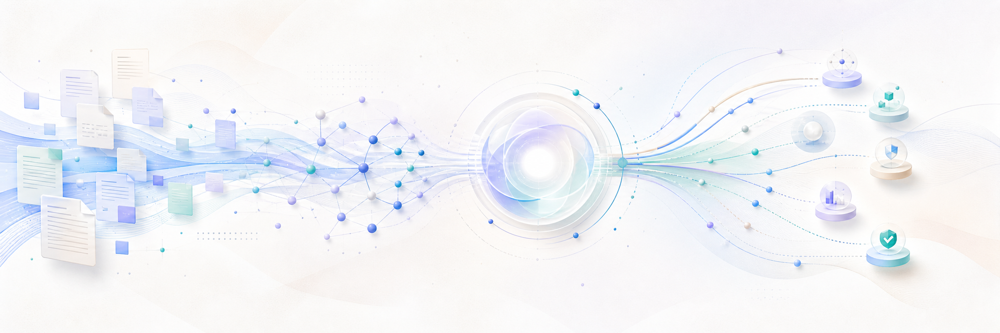
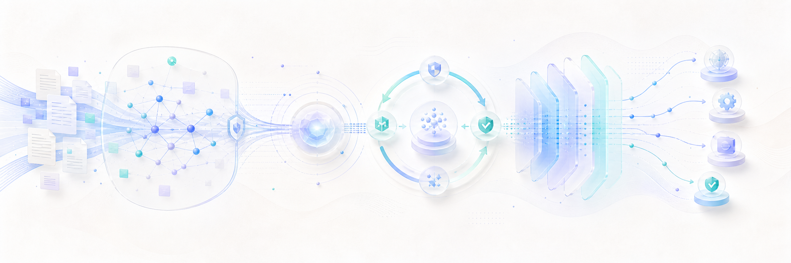

<p align="center">
  
</p>

<h1 align="center">RAG Agent 开发者</h1>

<p align="center">
  关注智能检索、上下文工程与可靠的 Agent 系统
</p>

<p align="center">
  
  
  
  
</p>

```yaml
角色: RAG Agent 开发者
方向:
  - 智能检索与上下文工程
  - 可学习的检索策略
  - 证据驱动的可靠推理
  - 生产级 Agent Runtime
愿景: 构建让 Agent 可以信赖的上下文基础设施
```

## 关于我

我专注于 RAG-Agent 与上下文工程，希望让大语言模型不仅能够生成内容，还能主动获取知识、判断证据、调用工具并完成任务。

相比单纯增加模型参数或上下文长度，我更关注整个系统是否真正可靠：检索是否准确、证据是否充分、工具是否可控、过程是否可观察、结果是否可以评估。

- 关注 RAG、Agentic RAG 与知识图谱检索
- 探索 Memory、Tool Retrieval 与 MCP 工具生态
- 重视 Agent Runtime、可观测性与安全边界
- 持续研究 RAG-Agent 的评测与工程化方法

<p align="center">
  
</p>

## 关注方向

| 方向 | 我关注的问题 |
| :--- | :--- |
| 智能检索 | 如何通过混合检索、重排与知识图谱找到真正相关的证据 |
| Agentic RAG | 如何让 Agent 根据任务复杂度决定是否检索、如何检索以及何时停止 |
| Context Engine | 如何统一组织知识、记忆、工具与任务上下文 |
| Agent Runtime | 如何让规划、工具调用、权限、预算与失败恢复形成稳定运行时 |
| 评测与安全 | 如何衡量检索、回答与任务执行质量，并限制高风险行为 |

## 技术能力

### RAG 与检索

- 文档解析、切分、索引与知识治理
- Sparse、Dense 与 Hybrid Retrieval
- RRF、Rerank 与 Knowledge Graph
- Query Rewrite、Multi-hop 与证据引用

### Agent 与上下文

- Planning、Routing 与 Tool Calling
- Memory、Skills 与 Experience Replay
- MCP、Multi-Agent 与 Computer Use
- Budget、Stop Condition 与 Failure Recovery

### 工程与评测

- Retrieval、Answer 与 Agent Evaluation
- Observability、Tracing、Cost 与 Latency
- Permission、Checkpoint、Rollback 与 Audit
- Prompt Injection 与工具调用安全

## 技术栈

<p align="center">
  
</p>

<p align="center">
  
  
  
  
  
</p>

```text
语言        Python · TypeScript · Kotlin
检索        Sparse · Dense · Hybrid · Rerank · Knowledge Graph
智能体      Planning · Routing · Tool Calling · Memory · Multi-Agent
工程        Evaluation · Observability · Guardrails · Cost · Latency
```

## 开发理念

1. **上下文质量比上下文长度更重要。**
2. **RAG 应该是可判断、可迭代的检索循环。**
3. **Agent 的关键结论和操作过程应该能够追溯。**
4. **系统优化必须通过稳定评测与真实任务证明。**
5. **权限、预算、失败恢复和安全边界属于运行时的一部分。**

## GitHub 动态

<p align="center">
  
</p>

<p align="center">
  
  
</p>

<p align="center">
  
  
  
</p>

## 交流

如果你也在研究 RAG、Agent、Memory、MCP 或 Context Engineering，欢迎通过 [GitHub Issues](https://github.com/augety121/augety121/issues) 交流。

<p align="center">
  <strong>让知识可检索，让推理有依据，让行动可验证。</strong>
</p>


