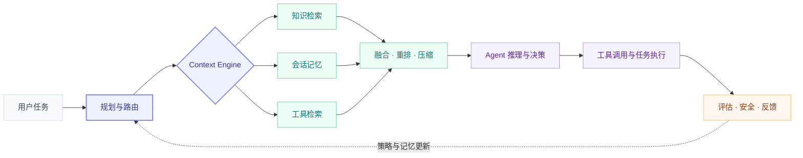

<p align="center">
  
</p>

<h1 align="center">Augety · RAG Agent Developer</h1>

<p align="center">
  构建面向未来的上下文引擎，让 Agent 能够持续获取知识、形成记忆并可靠行动。
</p>

<p align="center">
  
  
  
  
</p>

```yaml
name:     Augety
role:     RAG Agent 开发者
focus:    [ Agentic RAG, Memory, Tool Retrieval, Context Engine ]
building: 面向 Agent 的统一上下文基础设施
belief:   让知识可检索，让推理有依据，让行动可验证
```

## 👋 关于我

我正在开发 **RAG Agent 与知识增强型智能系统**。

相比只做一次性文档问答，我更关注 Agent 如何在真实任务中动态检索知识、管理长期记忆、发现可用工具，并在成本、延迟与安全边界内持续完成工作。

- 🧠 研究 RAG 如何从一次性模块演进为持续运行的检索循环
- 🧭 探索 Adaptive RAG、Agentic RAG 与 Graph RAG 的任务路由
- 💾 构建知识检索、会话记忆与工具检索统一的 Context Engine
- 🔌 关注 MCP、A2A、多 Agent 协作与可复用 Skills
- 📊 重视评估、可观测性、引用溯源、成本与延迟
- 🛡️ 将权限控制、Prompt Injection 防御与 Human-in-the-loop 纳入系统设计

> **Build the context layer that agents can trust.**

## 🔭 正在构建：面向 Agent 的 Context Engine

未来的 RAG 不只是“检索后生成”，而是 Agent 的统一上下文基础设施：

| 知识检索 | 会话记忆 | 工具检索 | 上下文编排 |
| :--- | :--- | :--- | :--- |
| 从可信知识源获取证据 | 跨会话保留高价值经验 | 按任务发现最相关工具 | 动态组织并交付有效上下文 |
| Hybrid Search / Rerank | 分层记忆 / 遗忘机制 | MCP / Tool Routing | 压缩 / 引用 / 权限边界 |



## 🧩 核心方向

### 01 · Agentic RAG

让 RAG 从一次检索变成可规划、可迭代的循环：

`思考 → 检索 → 评估证据 → 再检索 → 推理 → 行动`

- 根据任务复杂度选择检索策略
- 支持 Query Rewrite、Multi-Query 与多跳检索
- 为检索轮数、延迟和成本设置明确预算
- 用引用锚定减少跨文档证据拼接造成的幻觉

### 02 · Memory-Augmented Agent

让 Agent 不只记住对话，还能沉淀可复用的经验：

- 区分工作记忆、情景记忆、语义记忆与程序性记忆
- 根据重要性、时效性和访问频率进行分层管理
- 将成功工作流沉淀为可检索、可演进的 Skills
- 用压缩、遗忘与冲突消解控制长期记忆质量

### 03 · Tool Retrieval & MCP
