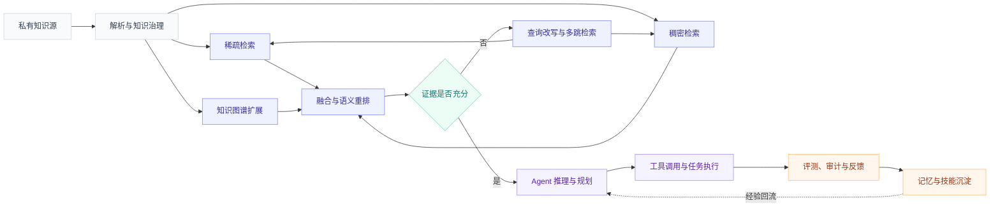

<p align="center">
  
</p>

<h1 align="center">Augety · RAG Agent Developer</h1>

<p align="center">
  专注本地优先的 RAG-Agent、可学习检索策略与生产级 Agent Runtime
</p>

<p align="center">
  
  
  
  
  
</p>

```yaml
name:      Augety
role:      RAG Agent Developer
focus:
  - Local-first RAG
  - Learnable Retrieval Policy
  - Evidence-grounded Reasoning
  - Production-grade Agent Runtime
direction: Context Engine for trustworthy agents
status:    Building in private
```

## 关于我

我正在研究和开发一套尚未公开的本地优先 RAG-Agent 系统。当前主页只展示公开方向与工程能力，不公开项目名称、仓库地址或内部实现细节。

我的关注点不是让模型“多回答一些内容”，而是让 Agent 在私有知识环境中完成一条可靠链路：理解任务、规划检索、获取证据、判断证据是否充分、调用工具执行，并对整个过程进行评测、审计与持续改进。

我希望解决的核心问题包括：

- 如何让私有资料尽可能留在本地，同时获得高质量的知识检索能力
- 如何让检索策略根据问题复杂度与领域语料动态变化
- 如何让复杂问题经过多步检索与证据自校验，而不是单轮召回后直接生成
- 如何把 Agent Loop 做成有预算、有权限、有停机条件、可回滚的生产级运行时
- 如何把知识、记忆、工具和技能统一为 Agent 可调用的上下文基础设施
- 如何用持续评测判断一次优化究竟让系统变好还是变差

> Build the context layer that agents can trust.

<p align="center">
  
</p>

## 当前方向

我把未来的 RAG-Agent 理解为一个持续运行的上下文系统，而不是简单的“检索器加生成器”。

```text
私有知识接入
    -> 混合检索与图谱扩展
    -> 证据融合、重排与引用
    -> 证据充分性判断
    -> 多步检索或查询改写
    -> Agent 推理与工具调用
    -> 评测、审计、记忆与策略更新
```

这条链路最终会收敛到一个统一的 Context Engine：

| 上下文类型 | 解决的问题 | 关注点 |
| :--- | :--- | :--- |
| 知识上下文 | Agent 当前需要知道什么 | 召回、重排、时效、引用 |
| 会话与长期记忆 | Agent 过去学到了什么 | 分层、压缩、遗忘、冲突处理 |
| 工具上下文 | Agent 当前可以调用什么 | Tool Retrieval、权限、作用域、MCP |
| 任务上下文 | Agent 现在应该完成什么 | 规划、状态、预算、停机条件 |
| 经验与技能 | Agent 下次如何做得更好 | 反馈、回放、复用、质量评分 |

## 系统思路



## 核心研究与工程方向

### 1. 本地优先的私有知识系统

对于企业、科研和专业机构，数据是否离开内网往往比模型参数更重要。我关注如何将文档解析、向量化、稀疏检索、语义重排与知识图谱尽可能部署在受控环境中，同时保留清晰的模型路由与降级策略。

重点包括：

- 私有文档的解析、切分、索引与生命周期治理
- 稀疏检索与稠密检索的多路召回
- Reciprocal Rank Fusion 与语义重排
- 知识图谱驱动的关系扩展与跨文档检索
- 本地模型、远程模型与不同任务角色之间的可控路由
- 依赖缺失或服务异常时的稳定降级

### 2. 可学习的检索策略

固定 Top-K 和固定提示词很难适应不同语料。简单问题可能只需要一次检索，复杂问题则需要拆解、比较、计算或跨文档追踪。

我关注让检索策略具备以下能力：

- 根据问题复杂度选择单步或多步检索
- 学习如何生成更有效的搜索查询
- 在用户自有语料上优化检索决策
- 为检索轮数、上下文长度、Token 与延迟设置预算
- 在证据不足时继续检索，在证据充分时及时停止
- 将检索策略与最终任务成功率共同评估

### 3. 证据自校验的深度检索

复杂 RAG 系统最危险的问题并不是“没有召回”，而是召回了互不支持的片段后，模型仍然拼出一个看似合理的结论。

我更关注以证据为中心的深度检索流程：

1. Agent 将复杂问题拆成可检索的子问题。
2. 检索层返回带编号、可追溯的证据。
3. 推理模型基于证据组织答案。
4. 自评模块判断证据覆盖度与答案接地程度。
5. 证据不足时改写查询并继续检索。
6. 多轮后仍无充分证据时，明确返回资料不足。

目标不是让系统永远回答，而是让它知道什么时候应该继续找、什么时候应该停止，以及什么时候应该诚实地说不知道。

### 4. 生产级 Agent Runtime

一个可演示的 Agent Loop 和一个可投入真实环境的 Agent Runtime 之间，差的是完整的工程约束。

我把运行时拆成三层：

| 层级 | 职责 | 关键约束 |
| :--- | :--- | :--- |
| Harness | 工具注册、上下文装配、权限、预算、事件流 | 默认拒绝、最小权限、可观测 |
| Loop | 计划、执行、观察、反思与停机 | 去重、熔断、失败隔离、结构化停止原因 |
| Computer Use | 桌面感知与操作执行 | 参数校验、风险确认、回放审计 |

我尤其关注：

- 高风险工具的权限闸与确认流程
- 工具调用、检索轮数和总体执行步骤的预算控制
- 无进展检测与重复调用熔断
- 有副作用操作前的检查点与失败回滚
- 子 Agent 并行执行时的预算隔离和结果归并
- 思考、工具开始、工具结束、文件产出与停止原因的统一事件协议
- 间接 Prompt Injection 与越界数据外发的确定性防线

### 5. 记忆、技能与持续改进

长期运行的 Agent 不能把全部历史对话重新塞回上下文。我关注将记忆拆分为可治理、可检索、可淘汰的结构。

- 工作记忆保存当前任务状态
- 长期记忆保留稳定偏好与高价值事实
- 经验回放记录策略、结果、失败原因与用户反馈
- 技能库沉淀可复用的操作流程
- 统一召回层从知识、记忆、工具与技能中选择当前最相关的上下文
- 通过质量评分和遗忘机制降低低价值记忆的权重

持续改进不意味着无限制自我修改，而是在可评估、可回滚、可审计的边界内积累更好的工作方法。

## 能力地图

| 领域 | 当前关注能力 |
| :--- | :--- |
| Knowledge Ingestion | 文档解析、切分、索引、元数据、时效治理 |
| Retrieval | BM25、Dense Retrieval、Hybrid Search、RRF、Rerank |
| Knowledge Graph | 实体关系抽取、社区发现、图谱扩展、跨文档推理 |
| Agentic RAG | Query Rewrite、Multi-hop、Adaptive Retrieval、Evidence Check |
| Agent Runtime | Planning、Tool Calling、Sub-agent、Budget、Stop Condition |
| Memory | Long-term Memory、Experience Replay、Skill Retrieval |
| Protocol | MCP、SSE、Structured Output、Typed Contract |
| Safety | Deny-first、Checkpoint、Rollback、Audit、Injection Defense |
| Engineering | Evaluation、Observability、Tracing、SLO、Cost and Latency |

## 评测方法

我倾向于把评测拆成五层，避免用一个总分掩盖系统问题：

| 评测层 | 主要问题 | 关注指标 |
| :--- | :--- | :--- |
| 检索质量 | 支持证据是否被召回并排在前面 | Recall@K、MRR、nDCG、Rerank Gain |
| 回答质量 | 答案是否正确、相关且有依据 | Accuracy、Faithfulness、Answer Relevance |
| 多跳能力 | 系统能否完成拆解、检索与证据组合 | 支持证据召回、平均跳数、引用覆盖率 |
| Agent 能力 | 系统是否选择正确工具并完成任务 | Task Success、Tool Selection、Recovery Rate |
| 工程与安全 | 系统能否稳定、经济且可控地运行 | P95 Latency、Cost、SLO、权限越界、注入测试 |

每次检索策略、Prompt、模型或重排器发生变化，都应该通过固定数据集做回归对比。自己的真实工作负载，比任何单一公开榜单都更能代表系统价值。

## 技术栈

<p align="center">
  
</p>

<p align="center">
  
  
  
  
  
  
</p>

```text
Languages      Python · TypeScript · Kotlin
Retrieval      Sparse · Dense · Hybrid · Rerank · Knowledge Graph
Agent          Planning · Routing · Tool Calling · Memory · Multi-Agent
Runtime        Harness · Loop · Computer Use · MCP
Engineering    Evaluation · Observability · Guardrails · Cost · Latency
```

## 开发理念

1. **RAG 是循环，不只是模块。** 系统应该根据证据质量决定是否继续检索。
2. **上下文质量比上下文长度更重要。** 正确的信息需要在正确的时机交给正确的模型。
3. **系统能力不等于模型能力。** 检索、路由、记忆、工具和运行时共同决定最终效果。
4. **关键结论应该可以追溯。** 引用、运行轨迹和工具记录是可靠性的组成部分。
5. **失败必须被设计。** 超时、预算耗尽、无进展和依赖缺失都要有明确退路。
6. **安全不是最后补上的功能。** 权限、确认、审计和回滚应进入运行时主链。
7. **优化必须通过评测证明。** 没有稳定回归集的提升，很可能只是一次偶然结果。

## GitHub 动态

<p align="center">
  
  
</p>

<p align="center">
  
</p>

## 交流

如果你也在研究 RAG、Agent Runtime、Memory、MCP、Context Engineering 或智能体评测，欢迎通过 [GitHub Issues](https://github.com/augety121/augety121/issues) 交流。

<p align="center">
  <strong>让知识可检索，让推理有依据，让行动可验证。</strong>
</p>

<p align="center">
  
</p>


