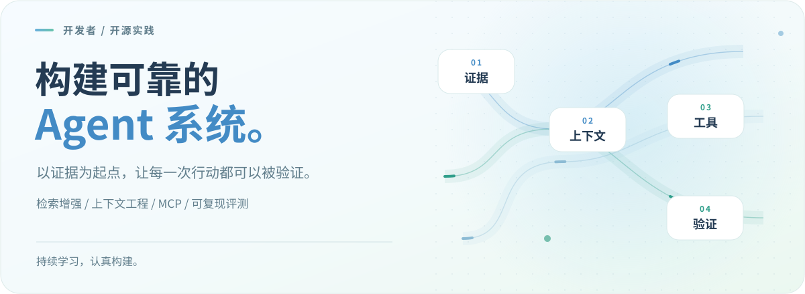
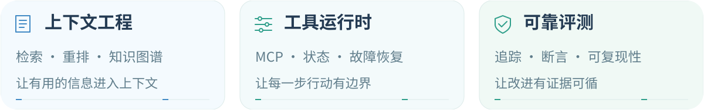
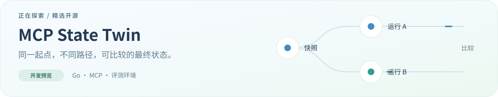
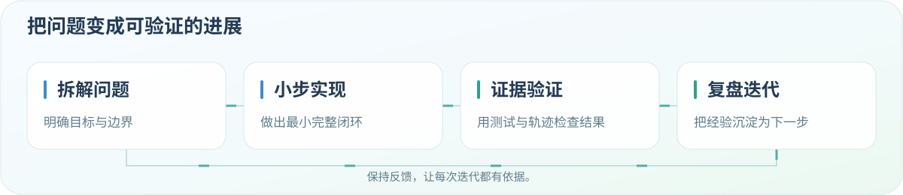
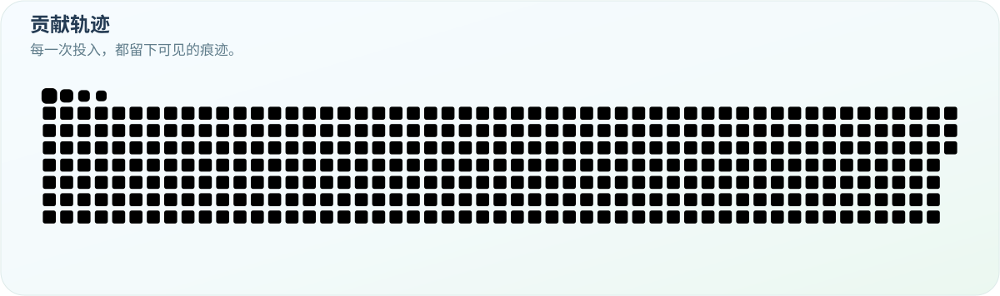

  <strong>简体中文</strong> &nbsp;/&nbsp; <a href="./README.en.md">English</a>

<picture>
  <source media="(max-width: 600px) and (prefers-reduced-motion: reduce)" srcset="./assets/profile/hero-mobile-zh-static.svg" />
  <source media="(prefers-reduced-motion: reduce)" srcset="./assets/profile/hero-zh-static.svg" />
  <source media="(max-width: 600px)" srcset="./assets/profile/hero-mobile-zh.svg" />
  
</picture>

  <a href="#about">关于我</a> &nbsp; · &nbsp; <a href="#work">精选项目</a> &nbsp; · &nbsp; <a href="#craft">开发方式</a> &nbsp; · &nbsp; <a href="#stack">技术栈</a> &nbsp; · &nbsp; <a href="#activity">开源足迹</a>

## 关于我

我是一名专注于 **RAG 与 Agent 系统工程**的开发者，关注知识如何成为上下文，以及上下文如何转化为可靠的行动。

这里记录我的开源实践、工程探索和持续学习。目前主要在研究 **MCP 工具环境与可复现评测**，也持续探索检索、记忆、运行时与安全边界。

<picture>
  <source media="(max-width: 600px) and (prefers-reduced-motion: reduce)" srcset="./assets/profile/focus-mobile-zh-static.svg" />
  <source media="(prefers-reduced-motion: reduce)" srcset="./assets/profile/focus-zh-static.svg" />
  <source media="(max-width: 600px)" srcset="./assets/profile/focus-mobile-zh.svg" />
  
</picture>

### 最近在探索

- **让检索更懂任务**：从相关性出发，关注查询规划、混合检索与重排，让证据真正服务于当前问题。
- **让工具环境可以复现**：围绕 MCP、状态快照与隔离运行，探索多步 Agent 行为如何被可靠地比较。
- **让上下文成为可管理的资源**：关注记忆选择、上下文预算与工具信息组织，在质量、成本和延迟之间寻找平衡。

我希望把这些探索沉淀成清晰的代码、可运行的实验和有依据的文档，也让这里成为一个持续成长的工程笔记本。

我在意的工程细节

- **上下文的质量**：相关、有依据，比单纯增加长度更重要。
- **工具的边界**：权限、预算和失败语义，是系统设计的一部分。
- **状态的可见性**：多步执行应当能够追踪、检查与恢复。
- **评测的可复现性**：从相同起点重新运行，才能比较真正的改进。

## 精选项目

<a href="https://github.com/augety121/MCP-State-Twin">
<picture>
  <source media="(max-width: 600px) and (prefers-reduced-motion: reduce)" srcset="./assets/profile/project-mobile-zh-static.svg" />
  <source media="(prefers-reduced-motion: reduce)" srcset="./assets/profile/project-zh-static.svg" />
  <source media="(max-width: 600px)" srcset="./assets/profile/project-mobile-zh.svg" />
  
</picture>
</a>

为 AI Agent 评测构建**可复现、可分叉、有状态的 MCP 测试世界**。不同运行从同一快照出发，在隔离环境里调用工具，再比较最终状态。

[查看源码 →](https://github.com/augety121/MCP-State-Twin) &nbsp; [阅读文档](https://github.com/augety121/MCP-State-Twin/tree/main/docs) &nbsp; [交流问题](https://github.com/augety121/MCP-State-Twin/issues)

项目处于开发预览阶段；已实现能力与边界以项目文档为准。

从哪里开始阅读？

- **快速了解**：从 [项目概览](https://github.com/augety121/MCP-State-Twin#readme) 了解它解决的问题与基本工作方式。
- **深入设计**：在 [项目文档](https://github.com/augety121/MCP-State-Twin/tree/main/docs) 中查看状态、工具契约、评测与实现边界。
- **交流改进**：通过 [Issues](https://github.com/augety121/MCP-State-Twin/issues) 讨论使用问题、复现案例和设计取舍。

## 我的开发方式

我更喜欢从一个具体问题开始，先建立最小可验证闭环，再逐步补齐状态、边界与观测能力。

<picture>
  <source media="(max-width: 600px) and (prefers-reduced-motion: reduce)" srcset="./assets/profile/craft-mobile-zh-static.svg" />
  <source media="(prefers-reduced-motion: reduce)" srcset="./assets/profile/craft-zh-static.svg" />
  <source media="(max-width: 600px)" srcset="./assets/profile/craft-mobile-zh.svg" />
  
</picture>

- **小而完整的实现**：让每次改动有清楚的目标、输入输出和适用范围。
- **能够复查的结果**：把成功路径、失败案例和关键取舍一起记录下来。
- **持续演进的设计**：先理解真实约束，再决定抽象、接口与扩展方式。

## 技术栈

  

**编程语言** &nbsp; Python · TypeScript · Go · Kotlin 
**工程工具** &nbsp; Docker · PostgreSQL · Redis · Git · GitHub Actions

技术之外，我也关注

接口与数据契约、测试与持续集成、日志与执行追踪、资源预算、权限边界，以及让后来者能快速理解系统的文档。

工具会变化，我希望保留的是分析问题、验证假设和把系统做扎实的能力。

## 开源足迹

<picture>
  <source media="(max-width: 600px)" srcset="./assets/profile/stats-mobile-zh.svg" />
  
</picture>

  <picture>
    <source media="(prefers-reduced-motion: reduce)" srcset="./assets/profile/contributions-static.svg" />
    <source media="(max-width: 600px)" srcset="./assets/profile/contribution-mobile-zh.svg" />
    
  </picture>

统计与贡献动画由 GitHub Actions 每日更新，更新时间见卡片；不是实时在线状态。贡献动画由 <a href="https://github.com/Platane/snk">Platane/snk</a> 生成。

---

### 一起交流

如果你也关注 **RAG、上下文工程、MCP 或 Agent 评测**，欢迎从一个问题、一段代码或一次实验开始交流。

可以聊一次检索效果的改进、一个工具接口的取舍、一种评测方法，或一个值得一起复现的想法。具体的问题和不同的视角，都很有价值。

[我的仓库](https://github.com/augety121?tab=repositories) &nbsp; · &nbsp; [项目讨论](https://github.com/augety121/MCP-State-Twin/issues) &nbsp; · &nbsp; [主页反馈](https://github.com/augety121/augety121/issues)

<picture>
  <source media="(prefers-reduced-motion: reduce)" srcset="./assets/profile/footer-zh-static.svg" />
  
</picture>

<a href="#top">返回顶部 ↑</a>

