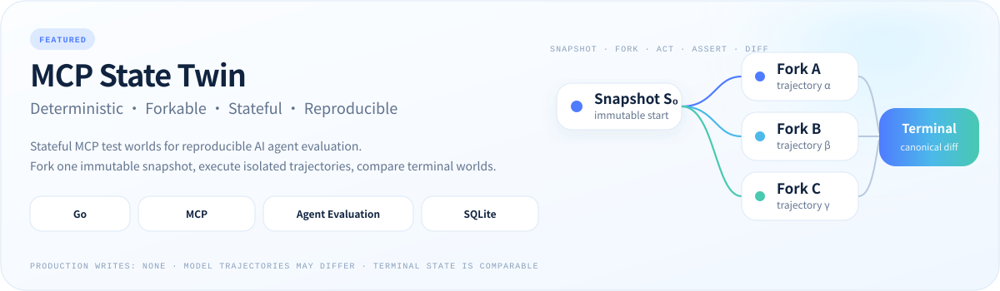
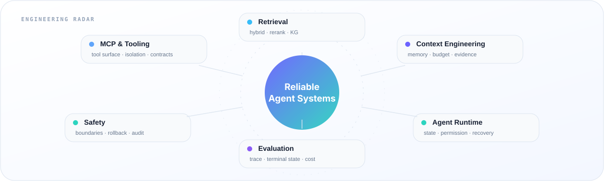
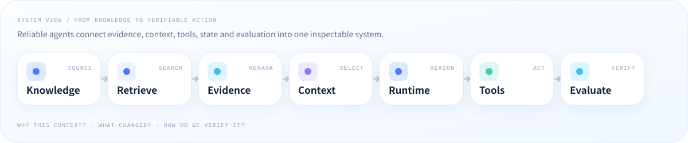
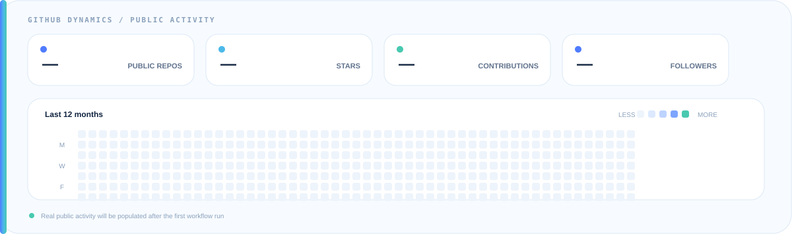
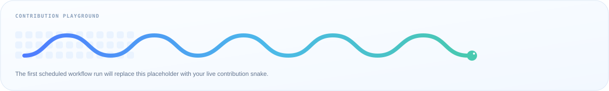

  

  <strong>简体中文</strong>
  &nbsp;·&nbsp;
  <a href="README.en.md">English</a>

  <a href="#featured">代表项目</a>
  &nbsp;·&nbsp;
  <a href="#focus">关注方向</a>
  &nbsp;·&nbsp;
  <a href="#system">系统视角</a>
  &nbsp;·&nbsp;
  <a href="#stack">技术栈</a>
  &nbsp;·&nbsp;
  <a href="#activity">GitHub 动态</a>

  我关注的不是一次“看起来很聪明”的回答，而是一个能够
  <strong>找到证据、组织上下文、受控调用工具、追踪状态并重复评测</strong>
  的 Agent 系统。

  RAG Agent · Context Engineering · MCP · Agent Runtime · Reproducible Evaluation

---

SELECTED WORK

## 代表项目

  

**MCP State Twin** 是我当前重点推进的开源项目：为 AI Agent 评测提供**确定性、可分叉、有状态**的 MCP 测试世界。

它允许不同 Agent / 模型从同一个不可变快照出发，采取不同但合法的工具轨迹，再依据**最终状态与声明的不变量**进行比较，而不把测试副作用写入生产服务。

  <a href="https://github.com/augety121/MCP-State-Twin"><strong>Repository</strong></a>
  &nbsp;·&nbsp;
  <a href="https://github.com/augety121/MCP-State-Twin#readme">README</a>
  &nbsp;·&nbsp;
  <a href="https://github.com/augety121/MCP-State-Twin/tree/main/docs">Docs</a>
  &nbsp;·&nbsp;
  <a href="https://github.com/augety121/MCP-State-Twin/issues">Issues</a>

<strong>为什么我把“状态”看成 Agent 评测的一等公民？</strong>

 

多步 Agent 的问题不只是“下一句话是什么”。一次工具调用会改变下一次调用应该看到的世界，因此真正可复现的评测需要固定并记录：

- 环境身份与工具契约；
- 初始快照与世界状态；
- 状态转换与失败语义；
- trace、断言与最终状态；
- 允许不同合法 trajectory，而不是强制模型逐步走同一条路径。

这也是 MCP State Twin 采用 **snapshot → fork → act → assert → diff** 工作流的原因。

---

ENGINEERING RADAR

## 我在构建什么

  

我的关注点横跨 Agent 的完整工程链路，而不是只停留在 Prompt 或模型调用层：

- **Retrieval**：Sparse / Dense / Hybrid Retrieval、RRF、Rerank、Knowledge Graph；
- **Context Engineering**：Evidence Selection、Memory、Context Budget、Query Planning；
- **Agent Runtime**：Planning、Routing、State、Checkpoint、Rollback、Failure Recovery；
- **MCP & Tooling**：工具契约、权限边界、隔离、幂等性与失败语义；
- **Evaluation**：Trace、Assertions、Terminal State、Cost、Latency、Reproducibility；
- **Safety**：Prompt Injection、Least Privilege、Auditability、不可逆副作用控制。

<strong>展开：我更在意哪些工程问题？</strong>

 

我更愿意持续追问这些问题：

1. **证据从哪里来？** 检索结果是否真的与当前任务相关，而不是“语义上看起来接近”？
2. **为什么这段上下文应该进入窗口？** Memory、工具描述、任务状态和历史信息是否有明确预算与选择逻辑？
3. **为什么 Agent 可以执行这个动作？** 权限、幂等性、预算和失败语义是否属于运行时，而不是只写在 Prompt 里？
4. **世界发生了什么变化？** 多步调用后的状态是否可观察、可审计、可回滚？
5. **成功如何被验证？** 是否能够根据状态、断言与证据评估，而不是只比较最终文本像不像参考答案？

---

SYSTEM VIEW

## 从知识到可验证行动

  

我更倾向把 Agent 看成一个**完整运行系统**：检索负责证据，Context Engine 负责选择，Runtime 负责状态与控制，工具负责行动，Evaluation 负责验证。

<strong>我的 Engineering Principles</strong>

 

1. **Context quality > context length.** 上下文不是越多越好，而是越相关、越有证据越好。
2. **State is part of the problem.** 多步 Agent 的后续行为必须建立在真实、可观察的状态变化之上。
3. **Tool calls need boundaries.** 权限、预算、幂等性、失败语义和回滚能力属于工具系统本身。
4. **Evaluation should be reproducible.** 评测应固定环境身份、起始状态、工具契约与证据，而不是依赖一次偶然成功。
5. **Observability is a feature.** Trace、audit、cost、latency 与 terminal state 应当可检查、可比较。
6. **Safety belongs in architecture.** 高风险动作不能只依赖 Prompt 约束，权限与控制边界必须进入系统设计。

<strong>展开：我如何判断一个 Agent 系统是否“可靠”？</strong>

 

- [ ] 关键回答能够回到证据；
- [ ] 上下文来源和选择过程可以解释；
- [ ] 工具调用有明确权限、预算和错误模型；
- [ ] 多步执行中的状态变化可以追踪；
- [ ] 失败后可以恢复、重试或安全终止；
- [ ] 评测能够从同一环境重新开始；
- [ ] 成功标准不仅依赖文本相似度，还包含状态与断言；
- [ ] 系统能够暴露 cost、latency、trace 与 audit 信息。

---

TOOLBOX

## 技术栈

  

  <code>Python</code> · <code>TypeScript</code> · <code>Go</code> · <code>Kotlin</code> ·
  <code>Docker</code> · <code>PostgreSQL</code> · <code>Redis</code> · <code>GitHub Actions</code>

<strong>展开：完整技术与工程关注栈</strong>

 

| Layer | Tools / Concepts |
| :--- | :--- |
| **Languages** | Python · TypeScript · Go · Kotlin |
| **Retrieval** | Sparse · Dense · Hybrid · RRF · Rerank · Knowledge Graph |
| **Context** | Evidence Selection · Memory · Context Budget · Query Planning |
| **Agent** | Planning · Routing · Tool Calling · Multi-Agent · MCP |
| **Runtime** | State · Permission · Checkpoint · Rollback · Audit · Failure Recovery |
| **Evaluation** | Retrieval / Answer / Agent Evaluation · Trace · Assertions · Terminal State · Cost · Latency |
| **Safety** | Prompt Injection · Tool Boundary · Least Privilege · Auditability |
| **Infra** | Docker · PostgreSQL · Redis · GitHub Actions |

---

PUBLIC ACTIVITY

## GitHub 动态

  

  仓库内 GitHub Actions 每日自动更新 · 数据来自公开 GitHub 活动

<strong>Contribution Playground · 展开查看贡献动画</strong>

 

  

  由 GitHub Actions + Platane/snk 自动生成并保存在本仓库。

<strong>这些动态数据是怎么生成的？</strong>

 

仓库中的 `scripts/generate_github_stats.py` 通过 GitHub GraphQL API 读取公开活动数据，并由 `.github/workflows/update-profile-stats.yml` 每日生成 SVG。

贡献动画由 `.github/workflows/update-contribution-snake.yml` 定期生成，因此主页打开时读取的是仓库内静态 SVG，而不是每次访问都实时请求第三方统计服务。

---

## Connect

  <a href="https://github.com/augety121"><strong>GitHub</strong></a>
  &nbsp;·&nbsp;
  <a href="https://github.com/augety121/MCP-State-Twin"><strong>MCP State Twin</strong></a>
  &nbsp;·&nbsp;
  <a href="https://github.com/augety121/MCP-State-Twin/issues"><strong>Project Issues</strong></a>
  &nbsp;·&nbsp;
  <a href="https://github.com/augety121/augety121/issues"><strong>Profile Issues</strong></a>

  如果你也在研究 <strong>RAG、Context Engineering、MCP、Agent Runtime、Agent Evaluation 或可靠 AI 基础设施</strong>，欢迎通过 GitHub 交流。

 

  

