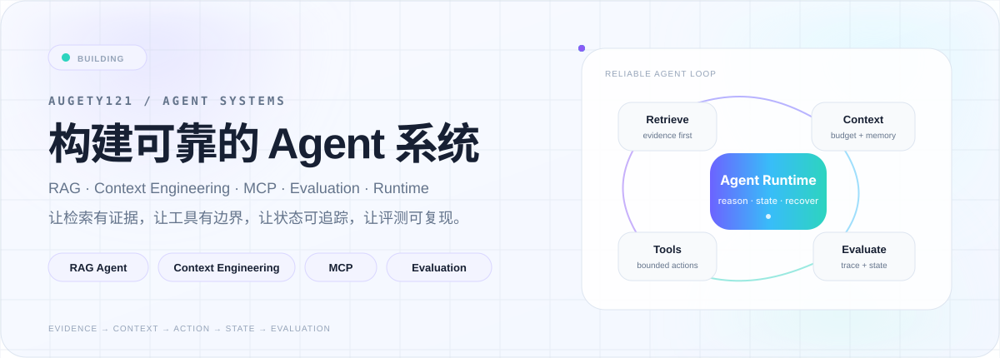

<p align="center">
  <picture>
    <source media="(prefers-color-scheme: dark)" srcset="./assets/hero-dark.svg">
    <source media="(prefers-color-scheme: light)" srcset="./assets/hero-light.svg">
    
  </picture>
</p>

<p align="center">
  <strong>简体中文</strong>
  &nbsp;·&nbsp;
  <a href="README.en.md">English</a>
</p>

<p align="center">
  <a href="#selected-work">代表项目</a>
  &nbsp;·&nbsp;
  <a href="#engineering-radar">Engineering Radar</a>
  &nbsp;·&nbsp;
  <a href="#system-view">系统视角</a>
  &nbsp;·&nbsp;
  <a href="#tech-stack">技术栈</a>
  &nbsp;·&nbsp;
  <a href="#github-dynamics">GitHub 动态</a>
</p>

---

<table>
<tr>
<td width="25%" align="center">
<strong>RETRIEVE</strong><br/>
<sub>检索真正相关的证据</sub>
</td>
<td width="25%" align="center">
<strong>CONTEXT</strong><br/>
<sub>把正确的信息放进窗口</sub>
</td>
<td width="25%" align="center">
<strong>ACT</strong><br/>
<sub>让工具调用有边界</sub>
</td>
<td width="25%" align="center">
<strong>EVALUATE</strong><br/>
<sub>让结果可以重复验证</sub>
</td>
</tr>
</table>

我主要关注 **RAG Agent、Context Engineering、MCP、Agent Runtime 与可复现评测**。

比起让 Agent 在一次 Demo 中“看起来很聪明”，我更在意它能否在真实任务里持续回答这些问题：**证据从哪里来？上下文为什么被选中？工具为什么可以调用？状态发生了什么变化？最终结果如何被验证？**

> **让知识可检索，让推理有依据，让行动有边界，让评测有状态。**

<a id="selected-work"></a>
## Selected Work

<p align="center">
  <a href="https://github.com/augety121/MCP-State-Twin">
    <picture>
      <source media="(prefers-color-scheme: dark)" srcset="./assets/mcp-state-twin-dark.svg">
      <source media="(prefers-color-scheme: light)" srcset="./assets/mcp-state-twin-light.svg">
      
    </picture>
  </a>
</p>

<p align="center">
  <a href="https://github.com/augety121/MCP-State-Twin"><strong>查看仓库</strong></a>
  &nbsp;·&nbsp;
  <a href="https://github.com/augety121/MCP-State-Twin#readme">README</a>
  &nbsp;·&nbsp;
  <a href="https://github.com/augety121/MCP-State-Twin/tree/main/docs">Docs</a>
  &nbsp;·&nbsp;
  <a href="https://github.com/augety121/MCP-State-Twin/issues">Issues</a>
</p>

**MCP State Twin** 是我当前重点推进的开源项目：为 AI Agent 评测提供确定性、可分叉、有状态的 MCP 测试世界。不同 Agent / 模型可以从同一个不可变快照出发，采取不同但合法的工具轨迹，再依据最终状态与声明的不变量进行比较，而不是把测试副作用写进生产服务。

<details>
<summary><strong>展开：为什么我认为“状态”是 Agent 评测的一等公民</strong></summary>
<br/>

多步 Agent 的问题并不只是“下一句话是什么”。一次工具调用会改变下一次调用应该看到的世界，因此真正可重复的评测需要固定：

- 环境身份与工具契约；
- 初始快照与世界状态；
- 状态转换与失败语义；
- trace、断言与最终状态；
- 允许不同合法 trajectory，而不是强制模型走同一条路径。

这也是 MCP State Twin 选择 **snapshot → fork → act → assert → diff** 作为核心工作流的原因。

</details>

<a id="engineering-radar"></a>
## Engineering Radar

<p align="center">
  <picture>
    <source media="(prefers-color-scheme: dark)" srcset="./assets/focus-map-dark.svg">
    <source media="(prefers-color-scheme: light)" srcset="./assets/focus-map-light.svg">
    
  </picture>
</p>

<table>
<tr>
<td width="33%" valign="top">
<strong>Retrieval & Context</strong><br/><br/>
Sparse / Dense / Hybrid Retrieval、Rerank、Knowledge Graph、Memory、Context Budget、Evidence Selection。
</td>
<td width="33%" valign="top">
<strong>Runtime & Tooling</strong><br/><br/>
MCP、Planning、Routing、Tool Calling、State、Permission、Checkpoint、Rollback、Failure Recovery。
</td>
<td width="33%" valign="top">
<strong>Evaluation & Safety</strong><br/><br/>
Trace、Terminal State、Assertions、Cost、Latency、Prompt Injection、Audit、Reproducibility。
</td>
</tr>
</table>

<a id="system-view"></a>
## System View

我更倾向把 Agent 看成一个**完整运行系统**，而不是一个孤立 Prompt。

<details open>
<summary><strong>展开 / 收起：从知识到可靠行动的 Context Engine</strong></summary>
<br/>

<p align="center">
  
</p>

```text
Knowledge
   ↓
Retrieval → Rerank → Evidence
   ↓
Context Engine
   ↓
Reasoning / Planning
   ↓
Tools + Memory + State
   ↓
Action
   ↓
Trace / Assertion / Evaluation
```

我希望系统中的关键决策最终都能回答三个问题：**依据是什么？发生了什么？结果如何验证？**

</details>

<details>
<summary><strong>展开：Engineering Principles</strong></summary>
<br/>

1. **Context quality > context length.** 上下文不是越多越好，而是越相关、越有证据越好。
2. **State is part of the problem.** 多步 Agent 的后续行为必须建立在真实、可观察的状态变化之上。
3. **Tool calls need boundaries.** 权限、预算、幂等性、失败语义和回滚能力都属于工具系统的一部分。
4. **Evaluation should be reproducible.** 评测应固定环境身份、起始状态、工具契约和证据，而不是依赖一次偶然成功。
5. **Observability is a feature.** Trace、audit、cost、latency 与 terminal state 应该能够被检查和比较。
6. **Safety belongs in architecture.** 高风险动作不能只依赖 Prompt 约束，权限与控制边界必须进入系统设计。

</details>

<a id="tech-stack"></a>
## Tech Stack

<p align="center">
  <picture>
    <source media="(prefers-color-scheme: dark)" srcset="https://skillicons.dev/icons?i=py,ts,go,kotlin,docker,postgres,redis,git,github&theme=dark&perline=9">
    <source media="(prefers-color-scheme: light)" srcset="https://skillicons.dev/icons?i=py,ts,go,kotlin,docker,postgres,redis,git,github&theme=light&perline=9">
    
  </picture>
</p>

<details>
<summary><strong>展开：完整技术与工程关注栈</strong></summary>
<br/>

| Layer | Tools / Concepts |
| :--- | :--- |
| **Languages** | Python · TypeScript · Go · Kotlin |
| **Retrieval** | Sparse · Dense · Hybrid · RRF · Rerank · Knowledge Graph |
| **Context** | Evidence Selection · Memory · Context Budget · Query Planning |
| **Agent** | Planning · Routing · Tool Calling · Multi-Agent · MCP |
| **Runtime** | State · Permission · Checkpoint · Rollback · Audit · Failure Recovery |
| **Evaluation** | Retrieval / Answer / Agent Evaluation · Trace · Assertions · Terminal State · Cost · Latency |
| **Safety** | Prompt Injection · Tool Boundary · Least Privilege · Auditability |
| **Infra** | Docker · PostgreSQL · Redis · GitHub Actions |

</details>

<a id="github-dynamics"></a>
## GitHub Dynamics

<p align="center">
  <picture>
    <source media="(prefers-color-scheme: dark)" srcset="./github-dynamics-dark.svg">
    <source media="(prefers-color-scheme: light)" srcset="./github-dynamics-light.svg">
    
  </picture>
</p>

<p align="center">
  <sub>仓库内 GitHub Actions 每日自动更新 · 不依赖第三方统计卡服务</sub>
</p>

<details>
<summary><strong>动态卡片是怎么生成的？</strong></summary>
<br/>

仓库中的 `scripts/generate_github_stats.py` 通过 GitHub GraphQL API 读取公开活动数据，并由 `.github/workflows/update-profile-stats.yml` 每日生成亮色 / 暗色两张 SVG。README 根据访客的 GitHub 主题自动选择对应版本。

</details>

## Connect

<p align="center">
  <a href="https://github.com/augety121"><strong>GitHub</strong></a>
  &nbsp;·&nbsp;
  <a href="https://github.com/augety121/MCP-State-Twin"><strong>MCP State Twin</strong></a>
  &nbsp;·&nbsp;
  <a href="https://github.com/augety121/MCP-State-Twin/issues"><strong>Project Issues</strong></a>
  &nbsp;·&nbsp;
  <a href="https://github.com/augety121/augety121/issues"><strong>Profile Issues</strong></a>
</p>

<br/>

<p align="center">
  <strong>Retrieval with evidence. Context with intent. Actions with boundaries. Evaluation with state.</strong>
</p>

<p align="center">
  <sub>augety121 · RAG Agent · Context Engineering · MCP · Reliable Agent Systems</sub>
</p>
