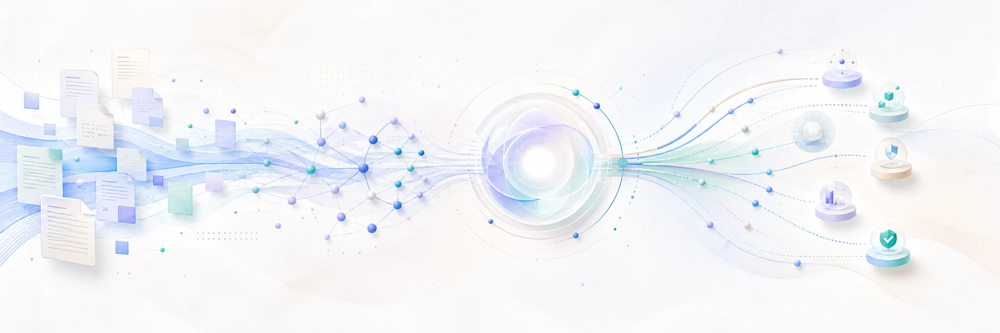
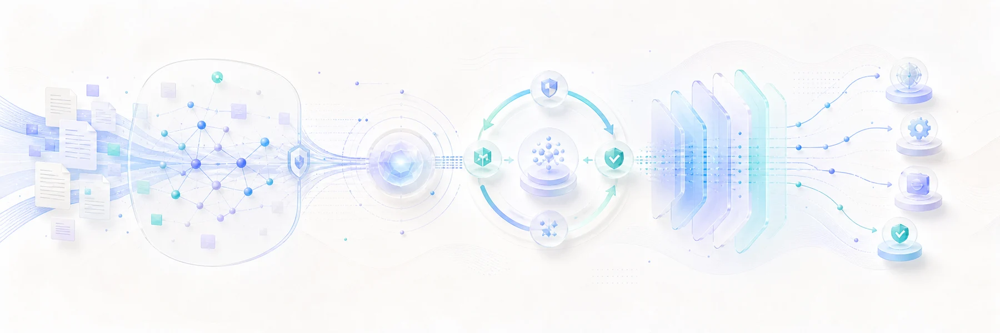
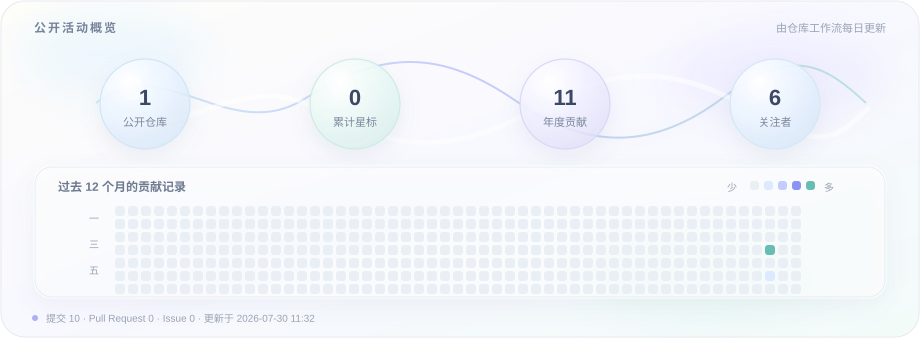

<p align="center">
  
</p>

<h1 align="center">augety121</h1>

<p align="center">
  <strong>RAG Agent · Context Engineering · Reliable Agent Infrastructure</strong>
</p>

<p align="center">
  构建可检索、可追溯、可控制、可评测的 Agent 系统。
</p>

<p align="center">
  <strong>简体中文</strong> · <a href="README.en.md">English</a>
</p>

<p align="center">
  <a href="#selected-work">代表项目</a> ·
  <a href="#engineering-focus">关注方向</a> ·
  <a href="#system-view">系统视角</a> ·
  <a href="#tech-stack">技术栈</a> ·
  <a href="#github-dynamics">GitHub 动态</a>
</p>

---

## About

我主要关注 **RAG Agent、上下文工程与可靠 Agent 基础设施**。

相比单纯扩大模型参数或上下文窗口，我更关心一个 Agent 系统在真实任务中能否稳定工作：**检索是否找到真正相关的证据、上下文是否足够干净、工具调用是否受控、状态变化是否可追踪、失败是否可恢复、结果是否可以被重复评测。**

当前持续投入的方向包括：

- 智能检索、Hybrid Retrieval、Rerank 与 Knowledge Graph；
- Agentic RAG、Query Planning、Tool Retrieval 与 Memory；
- MCP、Agent Runtime、状态管理与安全边界；
- Agent Evaluation、可观测性、回放与可复现测试环境。

> **目标不是让 Agent “看起来更聪明”，而是让它在证据、工具、状态和评测层面更可靠。**

<a id="selected-work"></a>
## Selected Work

### [MCP State Twin](https://github.com/augety121/MCP-State-Twin)

**Deterministic, forkable, stateful MCP test worlds for reproducible AI agent evaluation — without production side effects.**

用于可复现 AI Agent 评测的确定性、可分叉、有状态 MCP 测试世界。它允许不同 Agent / 模型从同一个不可变世界快照出发，采取不同但合法的工具调用轨迹，并通过最终状态与声明的不变量进行比较，而不把测试副作用写入生产服务。

<p>
  <a href="https://github.com/augety121/MCP-State-Twin"><strong>Repository</strong></a>
  ·
  <a href="https://github.com/augety121/MCP-State-Twin#readme">README</a>
  ·
  <a href="https://github.com/augety121/MCP-State-Twin/tree/main/docs">Docs</a>
</p>

`MCP` · `Agent Evaluation` · `Deterministic Runtime` · `Stateful Simulation` · `Go` · `SQLite`

---

<a id="engineering-focus"></a>
## Engineering Focus

| 方向 | 关注的问题 |
| :--- | :--- |
| **Retrieval** | 如何通过 Sparse / Dense / Hybrid Retrieval、Rerank 与图结构找到真正相关的证据 |
| **Context Engineering** | 如何组织知识、记忆、工具、任务状态与预算，让模型只看到当前真正需要的上下文 |
| **Agent Runtime** | 如何把 Planning、Tool Calling、Permission、Checkpoint、Rollback 与 Failure Recovery 变成稳定运行时 |
| **MCP & Tooling** | 如何让工具表面可组合、可验证、可隔离，并避免把测试控制能力泄露给 Agent |
| **Evaluation** | 如何同时评估 retrieval、answer、trajectory、terminal state、cost 与 latency，而不是只看单次文本输出 |
| **Safety** | 如何限制 Prompt Injection、高风险工具调用、权限升级与不可逆副作用 |

<a id="system-view"></a>
## System View

我更倾向把 Agent 看成一个完整系统，而不是一个孤立的 Prompt：

<p align="center">
  
</p>

```text
Knowledge
   ↓
Retrieval → Rerank → Evidence
   ↓
Context Engine
   ↓
Reasoning / Planning
   ↓
Tools + Memory + State
   ↓
Action
   ↓
Trace / Assertion / Evaluation
```

我希望系统中的关键决策都能回答三个问题：**依据是什么？发生了什么？结果如何验证？**

## Engineering Principles

1. **Context quality > context length.** 上下文不是越多越好，而是越相关、越有证据越好。
2. **State is part of the problem.** 多步 Agent 的后续行为必须建立在真实、可观察的状态变化之上。
3. **Tool calls need boundaries.** 权限、预算、幂等性、失败语义和回滚能力都属于工具系统的一部分。
4. **Evaluation should be reproducible.** 评测应固定环境身份、起始状态、工具契约和证据，而不是依赖一次偶然成功。
5. **Observability is a feature.** Trace、audit、cost、latency 与 terminal state 应该能够被检查和比较。

<a id="tech-stack"></a>
## Tech Stack

<p align="center">
  
</p>

| Layer | Tools / Concepts |
| :--- | :--- |
| **Languages** | Python · TypeScript · Go · Kotlin |
| **Retrieval** | Sparse · Dense · Hybrid · RRF · Rerank · Knowledge Graph |
| **Agent** | Planning · Routing · Tool Calling · Memory · Multi-Agent · MCP |
| **Runtime** | State · Permission · Checkpoint · Rollback · Audit · Failure Recovery |
| **Evaluation** | Retrieval / Answer / Agent Evaluation · Tracing · Cost · Latency · Safety |
| **Infra** | Docker · PostgreSQL · Redis · GitHub Actions |

<a id="github-dynamics"></a>
## GitHub Dynamics

<p align="center">
  
</p>

<p align="center"><sub>由仓库内 GitHub Actions 每日更新；数据来自公开 GitHub 活动。</sub></p>

## Connect

如果你也在研究 **RAG、Agent、Context Engineering、MCP、Agent Evaluation 或可靠 AI 基础设施**，欢迎通过 GitHub 交流：

- [GitHub Profile](https://github.com/augety121)
- [MCP State Twin Issues](https://github.com/augety121/MCP-State-Twin/issues)
- [Profile Repository Issues](https://github.com/augety121/augety121/issues)

<p align="center">
  <strong>让知识可检索，让推理有依据，让行动可验证。</strong><br/>
  <sub>Retrieval with evidence. Actions with boundaries. Evaluation with state.</sub>
</p>
