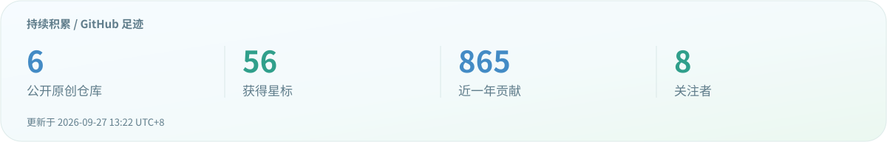

  <strong>简体中文</strong> &nbsp;/&nbsp; <a href="./README.en.md">English</a>

<picture>
  <source media="(max-width: 600px) and (prefers-reduced-motion: reduce)" srcset="./assets/profile/hero-mobile-zh-static.svg" />
  <source media="(prefers-reduced-motion: reduce)" srcset="./assets/profile/hero-zh-static.svg" />
  <source media="(max-width: 600px)" srcset="./assets/profile/hero-mobile-zh.svg" />
  
</picture>

  <a href="#about">关于我</a> &nbsp; · &nbsp; <a href="#work">精选项目</a> &nbsp; · &nbsp; <a href="#craft">开发方式</a> &nbsp; · &nbsp; <a href="#stack">技术栈</a> &nbsp; · &nbsp; <a href="#activity">开源足迹</a>

## 关于我

我是一名专注于 **RAG 与 Agent 系统工程**的开发者，关注知识如何成为上下文，以及上下文如何转化为可靠的行动。

这里记录我的开源实践：从 **MCP 工具环境与可复现评测**，到本地工具与浏览器扩展。让重复工作更少，让数据与行动的边界更清楚。

<picture>
  <source media="(max-width: 600px) and (prefers-reduced-motion: reduce)" srcset="./assets/profile/focus-mobile-zh-static.svg" />
  <source media="(prefers-reduced-motion: reduce)" srcset="./assets/profile/focus-zh-static.svg" />
  <source media="(max-width: 600px)" srcset="./assets/profile/focus-mobile-zh.svg" />
  
</picture>

### 最近在探索

- **检索与记忆** — 让证据贴近任务，让上下文保持有效。
- **工具与状态** — 让多步执行可以追踪、隔离与恢复。
- **评测与反馈** — 从相同起点出发，比较真正的改进。

我在意的工程细节

- **上下文的质量**：相关、有依据，比单纯增加长度更重要。
- **工具的边界**：权限、预算和失败语义，是系统设计的一部分。
- **状态的可见性**：多步执行应当能够追踪、检查与恢复。
- **评测的可复现性**：从相同起点重新运行，才能比较真正的改进。

## 精选项目

一部分项目探索 Agent 的能力与边界，一部分工具解决真实生活里的重复工作。

  <a href="#project-hashmm">知识工作空间</a> &nbsp; · &nbsp; <a href="#project-twin">Agent 评测</a> 
  <a href="#project-resume">简历填写</a> &nbsp; · &nbsp; <a href="#project-applykit">材料处理</a> &nbsp; · &nbsp; <a href="#project-autumn">公告聚合</a>

### Agent 与评测

从检索到行动，也从运行结果回到可验证的证据。

<a href="https://github.com/augety121/HashMM-RAG-Agent">
<picture>
  <source media="(max-width: 600px) and (prefers-reduced-motion: reduce)" srcset="./assets/profile/project-hashmm-mobile-zh-static.svg" />
  <source media="(prefers-reduced-motion: reduce)" srcset="./assets/profile/project-hashmm-zh-static.svg" />
  <source media="(max-width: 600px)" srcset="./assets/profile/project-hashmm-mobile-zh.svg" />
  
</picture>
</a>

将**知识检索、证据引用与可恢复任务**连接到同一个本地工作空间。这里展示公开的历史版本。

[查看源码 →](https://github.com/augety121/HashMM-RAG-Agent) &nbsp; [项目概览](https://github.com/augety121/HashMM-RAG-Agent#readme) &nbsp; [参与协作](https://github.com/augety121/HashMM-RAG-Agent/blob/main/COMMUNITY.md)

 

<a href="https://github.com/augety121/MCP-State-Twin">
<picture>
  <source media="(max-width: 600px) and (prefers-reduced-motion: reduce)" srcset="./assets/profile/project-mobile-zh-static.svg" />
  <source media="(prefers-reduced-motion: reduce)" srcset="./assets/profile/project-zh-static.svg" />
  <source media="(max-width: 600px)" srcset="./assets/profile/project-mobile-zh.svg" />
  
</picture>
</a>

面向 Agent 的**可复现 MCP 测试环境**：从同一快照分叉运行，在隔离环境中调用工具，比较最终状态。

[查看源码 →](https://github.com/augety121/MCP-State-Twin) &nbsp; [阅读文档](https://github.com/augety121/MCP-State-Twin/tree/main/docs) &nbsp; [交流问题](https://github.com/augety121/MCP-State-Twin/issues)

### 实用工具

从信息整理到材料准备，把重复步骤留给工具，把最后的判断留给自己。

<a href="https://github.com/augety121/jianlitianxie">
<picture>
  <source media="(max-width: 600px) and (prefers-reduced-motion: reduce)" srcset="./assets/profile/project-resume-mobile-zh-static.svg" />
  <source media="(prefers-reduced-motion: reduce)" srcset="./assets/profile/project-resume-zh-static.svg" />
  <source media="(max-width: 600px)" srcset="./assets/profile/project-resume-mobile-zh.svg" />
  
</picture>
</a>

面向 Chrome / Edge 的**本地填表助手**。先核对资料与字段，再填写选中内容；默认不调用模型，不自动提交申请。

[查看源码 →](https://github.com/augety121/jianlitianxie) &nbsp; [安装与使用](https://github.com/augety121/jianlitianxie/blob/main/docs/INSTALL-0.4.3.md) &nbsp; [隐私与权限](https://github.com/augety121/jianlitianxie/blob/main/docs/PRIVACY-0.4.3.md)

 

<a href="https://github.com/augety121/ApplyKit">
<picture>
  <source media="(max-width: 600px) and (prefers-reduced-motion: reduce)" srcset="./assets/profile/project-applykit-mobile-zh-static.svg" />
  <source media="(prefers-reduced-motion: reduce)" srcset="./assets/profile/project-applykit-zh-static.svg" />
  <source media="(max-width: 600px)" srcset="./assets/profile/project-applykit-mobile-zh.svg" />
  
</picture>
</a>

在本地完成**图片裁剪、PDF 转换与文件压缩**，让投递材料符合要求。保留原件，不上传材料到互联网。

[查看源码 →](https://github.com/augety121/ApplyKit) &nbsp; [下载使用](https://github.com/augety121/ApplyKit/releases) &nbsp; [使用说明](https://github.com/augety121/ApplyKit#readme)

 

<a href="https://github.com/augety121/autumn-jobs-crawler">
<picture>
  <source media="(max-width: 600px) and (prefers-reduced-motion: reduce)" srcset="./assets/profile/project-autumn-mobile-zh-static.svg" />
  <source media="(prefers-reduced-motion: reduce)" srcset="./assets/profile/project-autumn-zh-static.svg" />
  <source media="(max-width: 600px)" srcset="./assets/profile/project-autumn-mobile-zh.svg" />
  
</picture>
</a>

将**企业官方校园招聘公告**整理成可筛选的 Excel，保留来源与人工确认环节。不自动登录、绕过验证或投递。

[查看源码 →](https://github.com/augety121/autumn-jobs-crawler) &nbsp; [使用说明](https://github.com/augety121/autumn-jobs-crawler#readme) &nbsp; [安全边界](https://github.com/augety121/autumn-jobs-crawler/blob/main/SECURITY.md)

项目阅读指南与使用边界

- **先看概览，再看实现**：每个仓库的 README 说明用途和上手方式，文档记录设计与限制。
- **HashMM** 展示历史开源版本；**MCP State Twin** 仍处于开发预览阶段，不把路线图当作已实现功能。
- **简历填写助手** 只处理明确选中的资料，不自动提交；**ApplyKit** 保留原材料；**秋招公告聚合** 在访问受限或不确定时交人工确认。
- 简历填写助手支持可选的临时 MCP 协作；网站与控件的支持范围见文档，填写后仍需人工检查。
- HashMM 历史版本涵盖桌面端、Android 与工具扩展；公告聚合包含限速、去重和来源检查。具体能力以各项目文档为准。
- 深入了解 MCP State Twin 可从 [项目概览](https://github.com/augety121/MCP-State-Twin#readme)、[设计文档](https://github.com/augety121/MCP-State-Twin/tree/main/docs) 和 [Issues](https://github.com/augety121/MCP-State-Twin/issues) 开始。

<a href="https://github.com/augety121?tab=repositories&amp;type=public">浏览全部公开仓库 →</a>

## 我的开发方式

我更喜欢从一个具体问题开始，先建立最小可验证闭环，再逐步补齐状态、边界与观测能力。

<picture>
  <source media="(max-width: 600px) and (prefers-reduced-motion: reduce)" srcset="./assets/profile/craft-mobile-zh-static.svg" />
  <source media="(prefers-reduced-motion: reduce)" srcset="./assets/profile/craft-zh-static.svg" />
  <source media="(max-width: 600px)" srcset="./assets/profile/craft-mobile-zh.svg" />
  
</picture>

- **小而完整的实现**：让每次改动有清楚的目标、输入输出和适用范围。
- **能够复查的结果**：把成功路径、失败案例和关键取舍一起记录下来。
- **持续演进的设计**：先理解真实约束，再决定抽象、接口与扩展方式。

## 技术栈

  

**编程语言** &nbsp; Python · TypeScript · Go · Kotlin 
**工程工具** &nbsp; Docker · PostgreSQL · Redis · Git · GitHub Actions

技术之外，我也关注

接口与数据契约、测试与持续集成、日志与执行追踪、资源预算、权限边界，以及让后来者能快速理解系统的文档。

工具会变化，我希望保留的是分析问题、验证假设和把系统做扎实的能力。

## 开源足迹

<picture>
  <source media="(max-width: 600px)" srcset="./assets/profile/stats-mobile-zh.svg" />
  
</picture>

  <picture>
    <source media="(prefers-reduced-motion: reduce)" srcset="./assets/profile/contributions-static.svg" />
    <source media="(max-width: 600px)" srcset="./assets/profile/contribution-mobile-zh.svg" />
    
  </picture>

统计与贡献动画由 GitHub Actions 每日更新，更新时间见卡片；不是实时在线状态。贡献动画由 <a href="https://github.com/Platane/snk">Platane/snk</a> 生成。

---

### 一起交流

如果你也关注 **RAG、上下文工程、MCP 或 Agent 评测**，欢迎从一个具体问题、一段代码或一次可复现的实验开始交流。

[我的仓库](https://github.com/augety121?tab=repositories) &nbsp; · &nbsp; [项目讨论](https://github.com/augety121/MCP-State-Twin/issues) &nbsp; · &nbsp; [主页反馈](https://github.com/augety121/augety121/issues)

<picture>
  <source media="(prefers-reduced-motion: reduce)" srcset="./assets/profile/footer-zh-static.svg" />
  
</picture>

<a href="#top">返回顶部 ↑</a>

